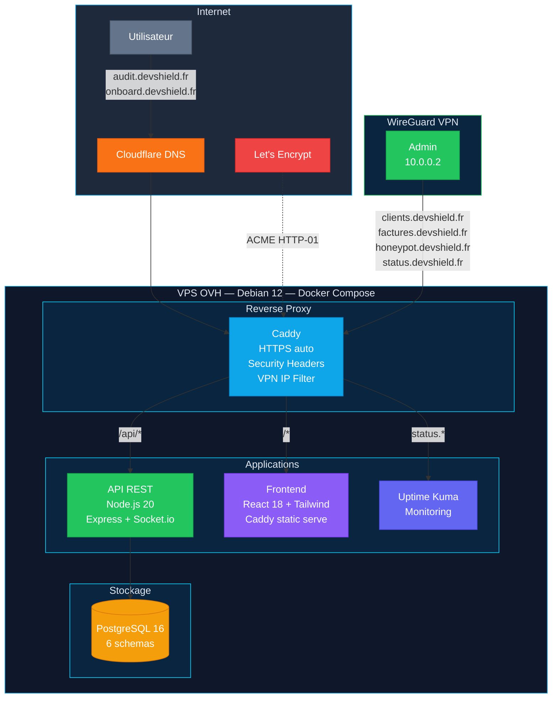
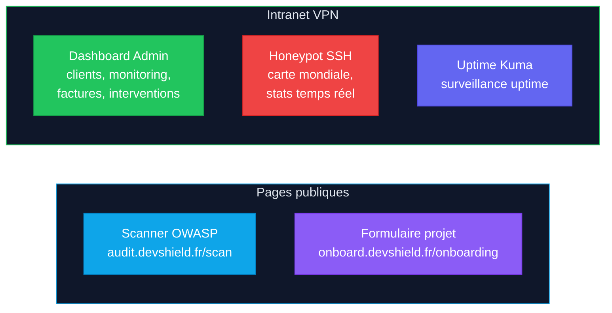

# DevShield Platform

Plateforme interne [DevShield](https://devshield.fr) pour la gestion de clients, la facturation, l'audit de sécurité OWASP, l'onboarding et la supervision d'un honeypot SSH.

Hebergée sur un VPS OVH (Debian 12), sécurisée par WireGuard VPN, conçue pour les artisans et PME.

## Stack technique

| Couche | Technologies |
|--------|-------------|
| **Backend** | Node.js 20, Express, PostgreSQL 16, Socket.io, Zod, PDFKit |
| **Frontend** | React 18, React Router v6, Tailwind CSS, Recharts, Leaflet.js |
| **Infra** | Docker Compose, Caddy (HTTPS auto), WireGuard (VPN admin) |
| **Sécurité** | JWT (httpOnly cookies), bcrypt, Helmet, CORS, rate limiting |

## Fonctionnalités

### 1. Authentification
- Login / Register avec JWT (access token 15min + refresh token 7j)
- Tokens stockés en cookies httpOnly sécurisés
- Rate limiting sur les tentatives de connexion

### 2. Formulaire d'onboarding
- Formulaire multi-étapes (entreprise, projet, design, confirmation)
- Route publique accessible sans authentification
- Vue admin pour consulter et gérer les soumissions

### 3. Gestion clients et facturation
- CRUD clients avec recherche
- Création de devis et factures avec packs prédéfinis (Landing Page / Essentiel / Optimal)
- Numérotation automatique (YYYY-NNN)
- Génération de PDF brandés DevShield avec mentions légales
- Gestion des statuts (brouillon, envoyée, payée, annulée)

### 4. Dashboard client
- Monitoring uptime (HTTP ping toutes les 5 minutes)
- Graphiques temps de réponse (Recharts)
- Vérification certificat SSL (émetteur, expiration, alerte < 30 jours)
- Historique des interventions par type (maintenance, MAJ, fix, sécurité)
- Vue admin avec sélection de client + ajout de sites et interventions

### 5. Scanner OWASP
- Analyse des headers de sécurité (HSTS, CSP, X-Frame-Options, etc.)
- Vérification SSL et protocole TLS
- Test de redirection HTTP vers HTTPS
- Analyse des flags cookies (Secure, HttpOnly, SameSite)
- Détection de technologies (Nginx, Apache, Cloudflare, etc.)
- Score global (0-100) avec note A à F
- Historique des scans
- Rate limiting strict (10 scans/min)

### 6. Dashboard honeypot SSH
- Parsing des logs Cowrie en temps réel
- Carte mondiale des attaques (Leaflet.js, thème dark)
- Géolocalisation IP (ip-api.com)
- WebSocket temps réel (Socket.io)
- Statistiques : top mots de passe, usernames, commandes, pays, IPs
- Graphique d'attaques par jour
- Timeline interactive avec filtres temporels

## Architecture



### Sous-domaines

| Sous-domaine | Accès | Description |
|---|---|---|
| `clients.devshield.fr` | VPN only | Dashboard admin, clients, factures, honeypot |
| `factures.devshield.fr` | VPN only | Redirection facturation |
| `honeypot.devshield.fr` | VPN only | Dashboard honeypot SSH |
| `status.devshield.fr` | VPN only | Uptime Kuma monitoring |
| `audit.devshield.fr` | Public | Scanner OWASP gratuit |
| `onboard.devshield.fr` | Public | Formulaire de prise en charge |



## Structure du monorepo

```
devshield-platform/
├── docker-compose.yml
├── Caddyfile
├── .env.example
├── db/
│   └── init.sql                 Schema complet PostgreSQL
├── packages/
│   ├── api/
│   │   └── src/
│   │       ├── index.js         Point d'entrée (Express + Socket.io)
│   │       ├── config/db.js     Connexion PostgreSQL
│   │       ├── middleware/       Auth JWT, validation Zod, rate limiting
│   │       ├── routes/          auth, clients, invoices, dashboard, audits, honeypot, onboarding
│   │       ├── services/        monitor, scanner, pdf, cowrie, geoip
│   │       └── utils/           logger, errors
│   └── frontend/
│       └── src/
│           ├── App.jsx          Routing React Router
│           ├── api/client.js    Fetch wrapper avec refresh auto
│           ├── components/      Layout, Card, Button, Input, Modal, StatusBadge
│           ├── pages/           Dashboard, Clients, Invoices, Audit, Honeypot, Onboarding
│           └── hooks/           useAuth
├── cowrie/                      Config honeypot SSH
├── backups/                     Scripts de sauvegarde
└── scripts/                     Setup VPS et déploiement
```

## Démarrage local

**Prérequis** : Docker et Docker Compose.

```bash
# 1. Configurer les variables d'environnement
cp .env.example .env
# Renseigner : DB_PASSWORD, JWT_SECRET, JWT_REFRESH_SECRET

# 2. Lancer les services
docker compose up -d --build

# 3. Créer un compte admin
docker compose exec api node src/seed/admin.js
```

L'application est disponible sur `http://localhost` et l'API sur `http://localhost/api/v1`.

## API

Toutes les routes sont préfixées par `/api/v1/`.

| Méthode | Route | Description |
|---------|-------|-------------|
| `POST` | `/auth/login` | Connexion |
| `POST` | `/auth/register` | Inscription |
| `POST` | `/auth/refresh` | Rafraîchir le token |
| `GET` | `/clients` | Liste des clients |
| `POST` | `/clients` | Créer un client |
| `GET/POST` | `/invoices` | Devis et factures |
| `GET` | `/invoices/:id/pdf` | Télécharger le PDF |
| `GET` | `/dashboard/overview` | Vue d'ensemble client |
| `GET` | `/dashboard/sites/:id/uptime` | Historique uptime |
| `GET` | `/dashboard/sites/:id/ssl` | Info certificat SSL |
| `POST` | `/audits/scan` | Lancer un scan OWASP |
| `GET` | `/audits` | Historique des scans |
| `GET` | `/honeypot/stats` | Statistiques honeypot |
| `GET` | `/honeypot/map` | Données carte attaques |
| `GET` | `/honeypot/events` | Timeline événements |
| `POST` | `/onboarding` | Soumission onboarding |

## Déploiement (VPS)

```bash
git pull origin main
sudo docker compose up -d --build
```

## Sécurité

- JWT stockés en cookies httpOnly (pas de localStorage)
- Mots de passe hashés avec bcrypt (cost 12)
- Validation de toutes les entrées avec Zod
- Requêtes SQL paramétrées uniquement
- Helmet.js (headers de sécurité)
- CORS configuré strictement
- Rate limiting sur toutes les routes
- Accès admin via VPN WireGuard

## Variables d'environnement

Voir `.env.example` pour la liste complète des variables requises.

## Licence

Projet propriétaire — [DevShield](https://devshield.fr)
